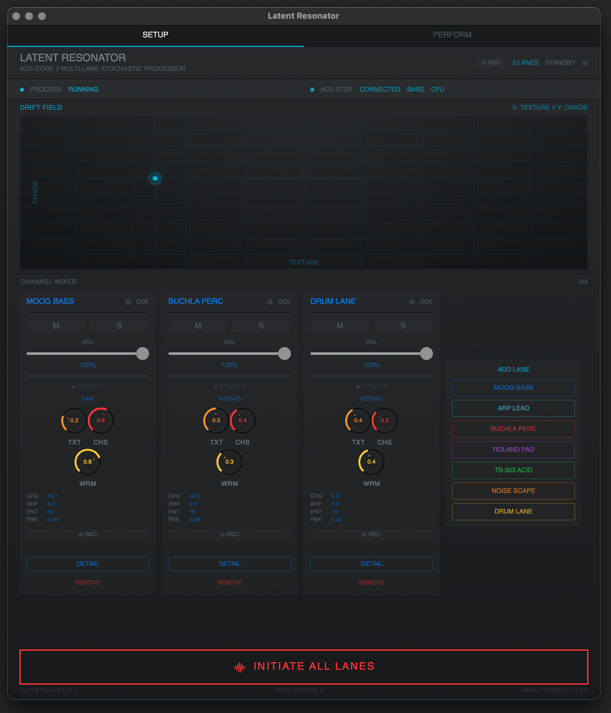
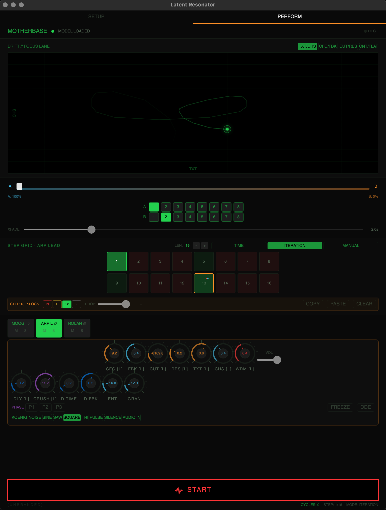
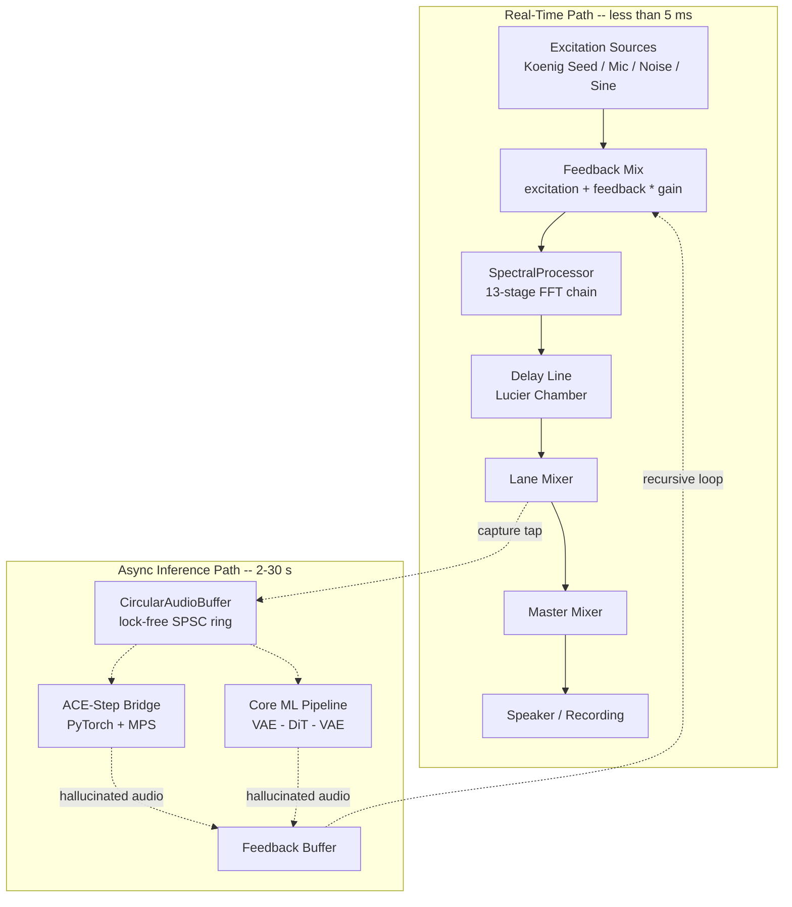

# Latent Resonator

[](https://github.com/U-N-B-R-A-N-D-E-D/Latent-Resonator/actions/workflows/ci.yml)
[](LICENSE)
[]()
[]()
[]()
[](CHANGELOG.md)

**A Non-Linear Spectral Processor powered by recursive neural inference.**

Latent Resonator transforms the ACE-Step 1.5 neural audio synthesis architecture into an executable instrument. Instead of generating songs, it establishes a *Neural Feedback Loop*--where inference output feeds back as input--inducing **generative degradation** that reveals the latent timbral biases of the neural network.

Grounded in the avant-garde traditions of Musique Concrète (Schaeffer), Stochastic Synthesis (Xenakis), Microsound (Roads), and Algorithmic Composition (Koenig), the system treats a diffusion model not as a composer but as a **Black Box Resonator**.

> *"We do not create music; we organize sound, and in the process, we allow the machine to reveal its own acoustic unconscious."*

## Screenshots

| Setup | Perform |
|-------|---------|
| [](docs/screenshots/setup.png) | [](docs/screenshots/perform.png) |

*Setup: multi-lane configuration, Drift Field, channel mixer. Perform: Motherbase, step grid, P-locks, XY pad, lane headers.*

---

## Audio Demo

**Texture Improvisation** -- 14 minutes 47 seconds of a live recursive session, unedited.
Euclidean impulses (Koenig Seed) enter the Neural Feedback Loop and emerge as self-organizing metallic textures, spectral drones, and granular artifacts.

[**Listen: latent_resonator_texture_improv.mp3**](docs/audio/latent_resonator_texture_improv.mp3) *(48 kHz stereo, 31 MB, 14m 47s)*

*Mastered to -15 LUFS integrated with brick-wall limiter at -0.1 dBTP.*

---

## Download

Pre-built macOS apps are available in [Releases](https://github.com/U-N-B-R-A-N-D-E-D/Latent-Resonator/releases). Download the zip, unzip, and drag `LatentResonator.app` to Applications (or run from anywhere).

**If macOS says the app is "damaged":** Gatekeeper blocks unsigned downloads. In Terminal:
```bash
xattr -cr /path/to/LatentResonator.app
```

---

## Architecture

The system runs on two independent clocks. The **real-time DSP path** (solid lines) processes audio at buffer rate (<5 ms latency). The **async inference path** (dotted lines) sends captured audio to ACE-Step or Core ML in the background (2-30 s per cycle) and feeds the hallucinated result back into the mix. When no neural engine is connected, the DSP path operates standalone as the "Black Box Resonator."



### Core Components

| Component | File | Purpose |
|---|---|---|
| **Neural Engine** | `NeuralEngine.swift` | Orchestrates the feedback loop, AVAudioEngine, and parameter control |
| **Sequencer Engine** | `SequencerEngine.swift` | Step grid state, advance logic, BPM, chain length |
| **Scene Manager** | `SceneManager.swift` | Scene bank, apply/capture, crossfade blending |
| **Core ML Inference** | `CoreMLInference.swift` | VAE Encoder -> DiT -> VAE Decoder pipeline with latent state management |
| **ACE-Step Bridge** | `ACEStepBridge.swift` | Swift async HTTP client for the Python bridge server |
| **WAV Codec** | `WAVCodec.swift` | WAV encoding/decoding for audio-to-HTTP transport |
| **Spectral Processor** | `SpectralProcessor.swift` | FFT-based Non-Linear Spectral Processor / Black Box Resonator (DSP fallback) |
| **Signal Generator** | `SignalGenerator.swift` | Multi-source excitation signals (noise, sine, impulses, mic input) |
| **Koenig Seed** | `KoenigSeedGenerator.swift` | Generates Euclidean rhythm E(5,13) Dirac impulses with Gaussian noise tails |
| **Circular Buffer** | `CircularAudioBuffer.swift` | Lock-free SPSC ring buffer for audio-to-inference thread communication |
| **Resonator Lane** | `ResonatorLane.swift` | Self-contained recursive feedback loop per lane -- implements S(i+1) = ACE(S(i) + N, P, gamma) |
| **Bridge Process Mgr** | `BridgeProcessManager.swift` | Manages Python bridge lifecycle: venv creation, deps, server launch, model auto-discovery |
| **Audio Recorder** | `AudioRecorder.swift` | Master recording to WAV in Documents |
| **Vectorscope** | _(TBI)_ | Metal-rendered Lissajous display -- deferred until a lower-memory implementation is available |
| **Bridge Server** | `ace_bridge_server.py` | Python HTTP server wrapping ACE-Step 1.5 inference |
| **Design System** | `Config/Constants.swift` (`DS` enum) | Centralized design tokens: typography scale, semantic colors, spacing, radii |
| **UI Components** | `Views/LRComponents.swift` | Reusable SwiftUI primitives: LRToggle, LRSegmentPicker, LRStatusRow, LRActionButton, LRParamSlider, LRSectionHeader, LRDivider |
| **UI Views** | `Views/` | SwiftUI views: LatentResonatorView (Setup), PerformanceMotherbaseView (Perform), LaneStripView, RetroKnob, LatentXYPad, SceneCrossfaderView |

### The Neural Feedback Loop

```
S(i+1) = ACE( S(i) + N(μ,σ), P, γ )
```

- **S(i)** -- audio signal at iteration *i*
- **N(μ,σ)** -- Gaussian noise (controlled by `inputStrength`)
- **P** -- abstract prompt vector (evolves across iterations)
- **γ** -- Guidance Scale / CFG (15.0–18.0 to overdrive the renderer)

---

## Requirements

| Requirement | Minimum | Recommended |
|---|---|---|
| **Chip** | Apple M1 | M1 Pro / M2 / M3 |
| **RAM** | 8 GB unified | 16 GB unified |
| **OS** | macOS 14.0 (Sonoma) | macOS 15 (Sequoia) |
| **Xcode** | 15.0+ | 15.4+ |
| **Python** | 3.10+ *(bridge server only, optional)* | 3.11 |
| **Disk** | ~200 MB (app) | ~7 GB (with ACE-Step model weights) |
| **Microphone** | Required for live audio input | -- |

### Portability & Security

The project is designed to run on any Mac without machine-specific paths or secrets:

- **Paths**: Model directory defaults to `~/Documents/LatentResonatorModels/`; recordings to `~/Documents/LatentResonator/`. Both configurable in Settings > Config.
- **Bridge**: Binds to `127.0.0.1` only (local use). No authentication; do not expose to the network.
- **Secrets**: No API keys or credentials in the repo. `.gitignore` excludes `.env`, `*.key`, `*.pem`.
- **Python venv**: App creates `~/Library/Application Support/LatentResonator/venv-ace-bridge/` (user-writable; fixes "Failed to create venv" when app is in /Applications or read-only locations).

### Optional: Core ML Models

The app gracefully degrades to DSP-only processing (Black Box Resonator mode) if Core ML models are not present. To enable full neural inference:

1. Run the conversion script:
   ```bash
   cd LatentResonator/LatentResonator/Scripts
   pip install -r requirements.txt
   python convert_ace_to_coreml.py
   ```
2. Copy the generated `.mlpackage` files to `LatentResonator/Resources/`

### ACE-Step Bridge Server (Recommended)

The ACE-Step Bridge provides a Python HTTP server that wraps ACE-Step 1.5 inference, allowing the Swift app to offload neural processing to PyTorch with MPS (Metal) acceleration.

```
┌─────────────────────┐    HTTP/JSON     ┌─────────────────────┐
│   Latent Resonator  │  <──────────>   │  ACE-Step Bridge    │
│   (Swift / macOS)   │    base64 WAV    │  (Python / PyTorch) │
│                     │                  │                     │
│  • DSP Processor    │    /health       │  • ACE-Step 1.5     │
│  • Feedback Loop    │    /infer        │  • MPS/CUDA accel   │
│  • Vectorscope (TBD)│    /status       │  • Passthrough mode │
└─────────────────────┘                  └─────────────────────┘
```

**Quick Start (passthrough mode -- no model download needed):**

```bash
cd LatentResonator/LatentResonator/Scripts
./setup_ace_bridge.sh
```

This creates a Python virtual environment, installs dependencies, and starts the bridge server on `http://127.0.0.1:8976`. The Swift app will auto-detect it via health polling.

**With full model download (~7GB):**

```bash
./setup_ace_bridge.sh --with-model
```

**With an existing model:**

```bash
./setup_ace_bridge.sh --start-only --model-path /path/to/ace-step-model
```

**Manual setup (without script):**

```bash
# Create virtual environment
python3 -m venv .venv-ace-bridge
source .venv-ace-bridge/bin/activate

# Install dependencies
pip install -r LatentResonator/LatentResonator/Scripts/requirements_bridge.txt

# Start server (passthrough mode)
python LatentResonator/LatentResonator/Scripts/ace_bridge_server.py

# Start server (with model)
python LatentResonator/LatentResonator/Scripts/ace_bridge_server.py \
  --model-path ACE-Step/Ace-Step1.5
```

**Local use only:** The bridge binds to `127.0.0.1` by default and is intended for use on the same machine as the app. Binding to `0.0.0.0` or a network interface exposes unauthenticated endpoints; use only in trusted environments.

The bridge server has three operating modes:
| Mode | When | Behavior |
|---|---|---|
| **Passthrough** | No model loaded | Echoes audio back; Swift DSP processes it |
| **Neural Inference** | Model loaded | Full ACE-Step pipeline on MPS/CUDA/CPU |
| **Disconnected** | Server not running | Swift app uses DSP-only fallback |

---

## Build from Source

```bash
# Open in Xcode
open LatentResonator/LatentResonator.xcodeproj

# Or build from command line
cd LatentResonator
xcodebuild -project LatentResonator.xcodeproj \
           -scheme LatentResonator \
           -destination 'platform=macOS' \
           build
```

### First Launch

1. **Grant microphone access** when prompted.
2. Wait for the ACE-Step bridge to initialize (loading model weights).
3. Press **START** to begin the feedback loop.
4. The Koenig Seed (Euclidean rhythm of Dirac impulses) will be injected automatically.
5. Adjust parameters in real-time to steer the generative degradation.

### Setup vs Performance (Motherbase)

The app has two modes (top bar: **SETUP** | **PERFORM**):

- **SETUP** -- Full mixer, lane strips, DETAIL popovers. Use for sound design and prep.
- **PERFORM** -- Fixed Motherbase surface: scenes (A/B crossfader), Elektron-style step sequencer, focus lane, master XY, vectorscope _(planned)_. Same controls in the same place for muscle memory.

### Step Sequencer (Perform View)

The step grid is an Elektron-inspired pattern sequencer with **parameter locks (P-Locks)**, **trig types**, and a configurable **chain length**.

**Trig Types** (set via right-click context menu on any step pad):

| Trig | Color | Behavior |
|---|---|---|
| **Note** | Red | Normal trigger -- fires audio + applies P-Locks |
| **Lock** (Trigless) | Yellow | Applies P-Locks without triggering a new note |
| **One-Shot** | Green | Fires once per pattern cycle, then skips until wrap |
| **Skip** | Gray | Step is silenced entirely |

**14 Lockable Parameters** (per-step, via knob manipulation while a step is selected):

| Category | Parameters |
|---|---|
| Primary (always visible) | CFG, Feedback, Filter Cutoff, Warmth |
| Secondary (shown during P-Lock editing) | Texture, Chaos, Delay Mix, BitCrush Depth |
| Additional | Prompt Phase, Denoise Strength, Filter Resonance, Excitation Mode, Entropy |
| Drum Lane | **DrumVoice** (kick, snare, hat, cymbal, mixed) — per-step prompt override for percussion character |

**Drum Lane**: Add a lane with the "DRUM LANE" preset. Use the DRUM row in the P-Lock header to lock kick/snare/hat/cymbal/mixed per step. The AI steers toward that percussion type for the next inference cycle. One lane, no extra synthesis. See whitepaper §2.10.

**Multi-Select (Shift+Click)**: Hold Shift and tap steps to select multiple. When 2+ steps are selected, a batch bar appears: apply trig type, DrumVoice, or Clear All to the selection. Clears when you switch lanes.

**P-Lock Editing**: Tap a step pad to enter edit mode. All knobs become context-aware (showing an `[L]` suffix and orange accent). A secondary knob row appears for extended parameters. The header bar provides trig type selection, DrumVoice picker (Drum Lane), probability slider, and copy/paste/clear actions.

**Chain Length**: Configurable 1--16 steps via the `LEN` stepper. Steps beyond the chain length are dimmed and inactive.

**Probability Gate**: Per-step probability (0--100%). Steps with probability < 100% fire stochastically.

**Step Advance Modes**: time-based, iteration-based, or manual.

### Drum Lane Tips (Getting Clearer Kick / Snare)

ACE-Step produces timbral *suggestions*, not literal 808 samples. The DrumVoice prompt steers the texture; these tips help:

- **Filter P-Lock per step**: Lock a low cutoff (100–300 Hz) on kick steps, mids (800–3k) on snare, highs (4k+) on hat. Combines with DrumVoice for clearer separation.
- **Lower feedback** (0.3–0.4) for tighter transients; higher (0.6+) for smeared, evolving textures.
- **Step advance = TIME + BPM**: If using iteration-based advance, each "step" lasts ~20s (one inference cycle). Use TIME mode at 60–120 BPM so steps change faster and you hear more prompt variety.
- **Rhythm vs timbre**: The Koenig seed provides the pulse; the DrumVoice affects the *character* of the next inference. Timbral change lags ~20s (inference time). Expect texture to evolve slowly, not hit-per-hit.
- **BUCHLA PERC** preset: Also Koenig-based, sometimes more percussive. Try it, add DrumVoice P-Locks on top.

**Layer Carving (§2.11)**: Each preset occupies a distinct frequency slot so lanes don't blend into one "reverberant landscape." MOOG BASS stays sub (LP 120 Hz), NOISE SCAPE is air-only (HP 2.5 kHz), etc. Polarized prompts ("NO bass", "NO air") push the model toward opposite latent regions. Combine lanes for a layered mix with clear separation.

Scenes and the step grid are aligned with the whitepaper recursive formula (§3.3, §4.2.2).

---

## Settings

Use **Cmd + ,** or the gear icon in the mode bar to open Settings. Configure:

| Setting | Default | Description |
|---|---|---|
| **ACE-Step Model Path** | `~/Documents/LatentResonatorModels/` | Directory containing ACE-Step model weights. Use Browse to select a custom location. |
| **Recording Output Directory** | `~/Documents/LatentResonator/` | Where master WAV recordings are saved. Use Browse to select a custom location. |
| **Bridge Port** | 8976 (read-only) | Local port for the Python bridge server |

### Model Path Discovery

The app searches for model weights in this order:

1. **Custom path** (if configured in Settings)
2. **Documents** (`~/Documents/LatentResonatorModels/`) — default, user-visible
3. **Application Support** (`~/Library/Application Support/LatentResonator/Models/`)
4. **Project root** (`{projectRoot}/models/`) — developer convenience

Place your downloaded ACE-Step weights in any of these locations. The app creates the default directories automatically on first launch.

---

## Keyboard Shortcuts

All major actions are reachable without a mouse. Also documented in Settings > SHORTCUTS.

### Transport

| Key | Action |
|---|---|
| `Space` | Start / Stop engine |
| `Escape` | Panic -- force stop all lanes |
| `R` | Toggle master recording (saves to configured directory; default `~/Documents/LatentResonator/`) |

### Navigation

| Key | Action |
|---|---|
| `Tab` | Switch SETUP / PERFORM views |
| `Cmd + ,` | Open Settings |
| `[` / `]` | Focus previous / next lane |

### Focus Lane

| Key | Action |
|---|---|
| `M` | Mute / unmute focus lane |
| `S` | Solo / unsolo focus lane |
| `F` | Toggle spectral freeze |

### Scenes

| Key | Action |
|---|---|
| `1` -- `8` | Load scene to A-side |
| `Shift + 1` -- `8` | Load scene to B-side |
| `Left` / `Right` | Nudge crossfader toward A / B |

### Sequencer

| Key | Action |
|---|---|
| `.` | Manual step advance (TAP) |
| `,` | Decrease chain length |
| `Shift + .` | Increase chain length |
| `Up` / `Down` | BPM +/- 10 (TIME mode) |

### Input Methods

All knobs respond to **vertical drag** and **scroll wheel / trackpad**. All sliders respond to **scroll wheel / trackpad**. Sensitivity: 0.3% of parameter range per scroll point.

---

## MIDI CC Map

Latent Resonator listens on all connected MIDI sources (class-compliant USB, network MIDI). CC messages route to the focus lane. Toggle parameters: CC < 64 = OFF, CC >= 64 = ON.

| CC | Parameter | Range |
|---|---|---|
| 20 | Volume | 0.0 -- 1.0 |
| 21 | Guidance Scale (CFG) | 3.0 -- 20.0 |
| 22 | Mute (toggle) | OFF / ON |
| 23 | Solo (toggle) | OFF / ON |
| 24 | Spectral Freeze (toggle) | OFF / ON |
| 25 | Texture | 0.0 -- 1.0 |
| 26 | Chaos | 0.0 -- 1.0 |
| 27 | Warmth | 0.0 -- 1.0 |
| 28 | Crossfader | 0.0 -- 1.0 |
| 29 | Feedback | 0.0 -- 1.0 |
| 30 | Filter Cutoff | 20 -- 20000 Hz |
| 31 | Filter Resonance | 0.0 -- 0.95 |
| 32 | Delay Mix | 0.0 -- 1.0 |
| 33 | Delay Time | 0.01 -- 2.0 s |
| 34 | Delay Feedback | 0.0 -- 0.95 |
| 35 | Bit Crush Depth | 2 -- 16 bits |
| 36 | Entropy | 0.0 -- 100.0 |
| 37 | Granularity | 0.0 -- 100.0 |

Also documented in Settings > MIDI.

---

## Controls

| Parameter | Range | Description |
|---|---|---|
| **Guidance Scale** | 3.0–20.0 | CFG "gain" -- higher values overdrive the renderer, inducing hallucinations |
| **Feedback Amount** | 0.0–1.0 | How much output feeds back as input for the next iteration |
| **Input Strength** | 0.0–1.0 | Balance between original signal structure and neural hallucination |
| **Entropy Level** | 0.0–100.0 | Controls stochastic noise injection into the latent space |
| **Granularity** | 0.0–100.0 | Microsound window size -- lower values create granular dust |
| **Prompt** | Free text | Semantic filter concept (e.g., "ferrofluid texture", "spectral degradation") |
| **Prompt Evolution** | Toggle | Automatically shifts prompt across iterations toward entropy maximization |
| **Denoise (per step)** | 0–100% | Performance step lock: how much ACE denoises (0 = DSP-only, 100% = full) |

### Recommended Starting Points

**Subtle Texturization:**
- Guidance: 8.0 | Feedback: 0.3 | Input Strength: 0.6
- Prompt: "granular synthesis, metallic decay"

**Full Machine Ghost:**
- Guidance: 16.0 | Feedback: 0.8 | Input Strength: 0.4
- Prompt: "ferrofluid texture, non-linear distortion"
- Enable Prompt Evolution

---

## Design System (DS)

The user interface is governed by a centralized design token system defined in `LRConstants.DS`. This eliminates hardcoded values across view files and enforces visual consistency.

### Typography Scale

All text uses **Fira Code** (monospaced). Five levels cover every role in the interface:

| Token | Size | Role |
|---|---|---|
| `fontCaption2` | 9pt | Metadata, status dots, tiny readouts |
| `fontCaption` | 10pt | Section headers, labels, bridge status |
| `fontBody` | 12pt | Primary text, lane names, buttons |
| `fontTitle` | 14pt | View titles, popover headers |
| `fontHeadline` | 16pt | Trigger buttons, app title |

### Semantic Color Palette

Colors are defined by function, not by literal value:

| Token | Value | Role |
|---|---|---|
| `textPrimary` | white 90% | Active, high-priority text |
| `textSecondary` | phosphor green 70% | Labels, secondary information (green-tinted) |
| `textTertiary` | phosphor green 50% | Hints, disabled labels (green-tinted) |
| `textDisabled` | phosphor green 30% | Inactive indicators (green-tinted) |
| `surfacePrimary` | RGB(0.03) | Main background |
| `surfaceElevated` | white 6% | Section backgrounds for visual grouping |
| `surfaceOverlay` | white 8% | Sheets, popovers |
| `border` | gray 20% | Default borders |
| `borderActive` | gray 50% | Hover / active borders |
| `danger` / `warning` / `success` / `info` | red / orange / green / cyan | Functional status colors |
| `trigNote` / `trigLock` / `trigOneShot` / `trigSkip` | red / yellow / green / gray | Step sequencer trig type indicators |

### Spacing Scale

Five levels ensure consistent rhythm across all layouts:

| Token | Value | Usage |
|---|---|---|
| `spacingXS` | 3pt | Tight inline spacing |
| `spacingSM` | 6pt | Between related elements |
| `spacingMD` | 10pt | Standard element gaps |
| `spacingLG` | 16pt | Between sections |
| `spacingXL` | 20pt | Outer padding |

### Reusable Components (LRComponents.swift)

Seven SwiftUI primitives enforce consistent interaction patterns:

| Component | Purpose | Used by |
|---|---|---|
| `LRToggle` | Binary toggle (M, S, FREEZE, TRIGLESS, REC) | LaneStripView, PerformanceMotherbaseView |
| `LRSegmentPicker` | Horizontal mode selector (ExcitationMode, FilterMode, XYAxisMode) | LaneStripView, PerformanceMotherbaseView |
| `LRStatusRow` | Status indicator: dot + label + value + extras | LatentResonatorView (bridge status) |
| `LRSectionHeader` | Section header with tracking and optional trailing text | All views |
| `LRDivider` | 1px divider using design tokens | All views |
| `LRActionButton` | Trigger-style button (INITIATE, ABORT, PANIC) | LatentResonatorView, PerformanceMotherbaseView |
| `LRParamSlider` | Parameter slider with label and value readout | LaneDetailPopover |

All components include hover states (`.onHover`) for macOS affordance and state transition animations (`.animation(.easeInOut(duration: 0.15))`).

### Accent Color System

Each lane preset defines an `accentColor` string (e.g., "blue", "cyan", "red"). This string is stored on `ResonatorLane.accentColorName` at initialization and resolved to a SwiftUI `Color` via the shared helper `LRConstants.DS.accentColor(for:)`. This replaces the fragile switch-on-lane-name pattern that was previously duplicated across view files.

---

## Testing

### Python Bridge Tests (included)

The Python bridge codec tests are included in the repository and run in CI:

```bash
pytest LatentResonator/LatentResonator/Scripts/test_bridge.py -v
```

### Swift Test Suite (not included)

The Swift unit test suite (269 test methods across 8 test files) is maintained privately and is not distributed with this repository. It covers:

- Constants and range validation (54 tests)
- Performance state: scenes, step grid, snapshots, persistence (58 tests)
- Spectral processor: FFT, filters, knob checks, stress sweep (46 tests)
- Signal generator: all excitation modes, noise statistics, Euclidean rhythm (31 tests)
- Parameter routing: CC scaling, delay line, macros, multi-lane concurrency (52 tests)
- NeuralEngine: cross-lane feedback routing, step microtiming, scene apply (8 tests)
- Circular audio buffer: wrap-around, overflow, SPSC concurrency (11 tests)
- WAV codec: encode/decode round-trips, error handling (9 tests)

Contributors are encouraged to add their own tests when submitting pull requests. See [CONTRIBUTING.md](CONTRIBUTING.md) for guidelines.

---

## Python Scripts

Located in `LatentResonator/LatentResonator/Scripts/`:

| Script | Purpose |
|---|---|
| `ace_bridge_server.py` | HTTP bridge wrapping ACE-Step 1.5 inference for the Swift app |
| `setup_ace_bridge.sh` | One-command setup: venv + deps + optional model download + server start |
| `generate_koenig_seed.py` | Generate the Koenig Seed WAV file (Euclidean rhythm + Dirac impulses) |
| `convert_ace_to_coreml.py` | Convert ACE-Step 1.5 model components to Core ML format |
| `test_bridge.py` | Pytest suite for bridge API (encode/decode, inference contract) |

```bash
# Start the ACE-Step bridge server (recommended)
./setup_ace_bridge.sh

# Run bridge tests (from repo root)
pytest LatentResonator/LatentResonator/Scripts/test_bridge.py

# Generate a custom Koenig Seed
python generate_koenig_seed.py --duration 10.0 --pulses 5 --steps 13 --output seed.wav

# Convert models (requires PyTorch + coremltools)
python convert_ace_to_coreml.py --model-path ACE-Step/Ace-Step1.5
```

---

## Project Structure

```
RLTNAS/
├── README.md
├── CHANGELOG.md                     # Version history
├── LICENSE                          # MIT License
├── CONTRIBUTING.md
├── pyproject.toml                   # Python: black, flake8, pylint
├── .flake8                          # Flake8 config
├── .gitignore
├── docs/
│   ├── whitepaper.md                # Full research paper
│   └── audio/
│       └── latent_resonator_texture_improv.mp3  # Full session (14m 47s)
└── LatentResonator/
    ├── LatentResonator.xcodeproj/
    └── LatentResonator/
        ├── LatentResonatorApp.swift    # App entry point
        ├── RootView.swift              # SETUP | PERFORM mode switch + Settings
        ├── NeuralEngine.swift          # Multi-lane audio engine + step grid + scenes
        ├── SequencerEngine.swift       # Step grid state, advance modes, BPM
        ├── SceneManager.swift          # Scene bank, apply/capture, crossfade
        ├── ResonatorLane.swift         # Per-lane recursive feedback loop (the core formula)
        ├── BridgeProcessManager.swift  # Python bridge lifecycle + model auto-discovery
        ├── AudioRecorder.swift         # Master recording to WAV
        ├── CoreMLInference.swift       # Core ML pipeline (on-device fallback)
        ├── SpectralProcessor.swift     # FFT-based DSP processor (DSP fallback)
        ├── KoenigSeedGenerator.swift   # Euclidean rhythm seed E(5,13)
        ├── SignalGenerator.swift       # Multi-source signal generator
        ├── CircularAudioBuffer.swift   # Lock-free ring buffer
        ├── ACEStepBridge.swift         # Swift HTTP client for bridge server
        ├── WAVCodec.swift              # WAV encode/decode for HTTP transport
        ├── Config/
        │   ├── Constants.swift         # All tuning parameters, lane presets, design system (DS)
        │   ├── PerformanceState.swift  # Scenes, step grid, parameter locks (Motherbase)
        │   └── ParameterRouter.swift   # MIDI CC mapping (ControlParameter, scaleCCToValue)
        ├── Metal/                          # (planned -- not yet implemented)
        │   ├── Vectorscope.metal
        │   └── VectorscopeRenderer.swift
        ├── Views/
        │   ├── LRComponents.swift          # Reusable UI components (design system primitives)
        │   ├── LatentResonatorView.swift   # Setup: full mixer + bridge status + DETAIL
        │   ├── PerformanceMotherbaseView.swift  # Perform: scenes, crossfader, step grid
        │   ├── SceneCrossfaderView.swift        # Scene A/B crossfader + load buttons
        │   ├── LaneStripView.swift     # Per-lane mixer strip + DisclosureGroup detail popover
        │   ├── RetroKnob.swift         # Precision dial with 270-degree sweep and tick marks
        │   └── LatentXYPad.swift       # CRT-style 2D XY pad with coordinate readout
        ├── Scripts/
        │   ├── requirements.txt      # Python conversion deps
        │   ├── requirements_bridge.txt # ACE-Step bridge deps
        │   ├── setup_ace_bridge.sh   # One-command bridge setup
        │   ├── ace_bridge_server.py  # Python HTTP bridge server
        │   ├── convert_ace_to_coreml.py
        │   └── generate_koenig_seed.py
        ├── Resources/               # Core ML models go here
        ├── Info.plist
        └── LatentResonator.entitlements
```

---

## Theoretical Background

This project implements the methodology described in the accompanying white paper: [Recursive Latent Trajectories in Neural Audio Synthesis](docs/whitepaper.md).

Key concepts:

- **Alvin Lucier's** *I Am Sitting in a Room* (1969) -- recursive acoustic filtering as composition
- **Iannis Xenakis** -- stochastic synthesis and formalized music
- **Curtis Roads** -- microsound and granular synthesis
- **Gottfried Michael Koenig** -- algorithmic composition with mathematical structures
- **ACE-Step 1.5** -- hybrid LLM + Diffusion Transformer architecture for audio

The Neural Feedback Loop is a digital resurrection of analog recursive techniques, operating within the high-dimensional latent space of a diffusion model rather than physical acoustic space.

---

## Acknowledgments

### Theoretical Sources

This project implements concepts from the following foundational works. Full citations are in the [white paper](docs/whitepaper.md) (References section).

- **Alvin Lucier** -- *I Am Sitting in a Room* (1969): recursive acoustic filtering as composition
- **Iannis Xenakis** -- *Formalized Music* (1971): stochastic synthesis and mathematical composition
- **Pierre Schaeffer** -- *Traité des objets musicaux* (1966): acousmatic listening and sound objects
- **Curtis Roads** -- *Microsound* (2001): granular and microsound synthesis
- **Gottfried Michael Koenig** -- *Project One / Project Two* (1970): algorithmic composition with mathematical structures
- **Godfried Toussaint** -- "The Euclidean Algorithm Generates Traditional Musical Rhythms" (2005, BRIDGES)
- **Norbert Wiener** -- *Cybernetics* (1948): machine emergent behavior and post-humanist philosophy
- **ACE-Step Team** -- "ACE-Step: A Step Towards Music Generation Foundation Model" (2025, arXiv)
- **Ho, Jain & Abbeel** -- "Denoising Diffusion Probabilistic Models" (2020, NeurIPS)
- **Rombach et al.** -- "High-Resolution Image Synthesis with Latent Diffusion Models" (2022, CVPR)

### Frameworks and Tools

The macOS application uses exclusively Apple system frameworks (no third-party dependencies):

| Framework | Usage |
|---|---|
| AVFoundation | Real-time audio engine, microphone input |
| CoreML | On-device neural inference (VAE, DiT) |
| Metal / MetalKit | Lissajous vectorscope rendering _(planned)_ |
| Accelerate (vDSP) | FFT, spectral processing, vector math |
| Foundation (URLSession) | HTTP client for ACE-Step bridge server |
| SwiftUI | User interface |

The ACE-Step bridge server (Python) uses Flask, NumPy, and optionally PyTorch + soundfile.
See `Scripts/requirements_bridge.txt` for details and licenses.

## Contributing

Contributions are welcome. Please read [CONTRIBUTING.md](CONTRIBUTING.md) before submitting a pull request.

All contributions will be licensed under the MIT License. By submitting a pull request, you agree to these terms.

---

## License

[MIT](LICENSE) -- Copyright (c) 2026 Leo Lambertini
